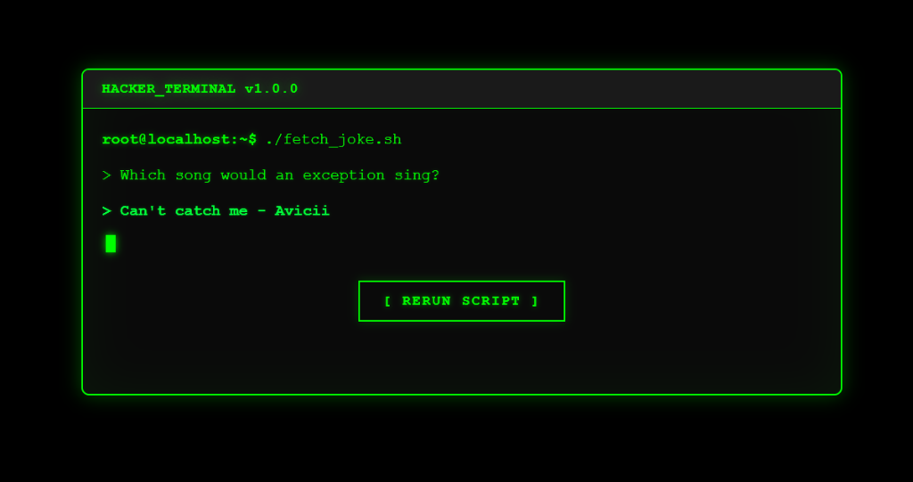

<div align="center">

# 💀 Hacker Terminal

### **A retro CLI joke machine that makes you look like you're hacking the mainframe**

[](https://react.dev/)
[](https://vitejs.dev/)
[](https://hacker-terminal-demo.vercel.app/)

---

*Because every developer needs a terminal that tells dad jokes while looking absolutely elite* 🧑‍💻

**[🚀 Try the Live Demo](https://hacker-terminal-demo.vercel.app/)**

</div>

---

## 📸 Preview



---

## 🤔 What is this?

**Hacker Terminal** is a fun little React project that simulates a retro command-line interface. It fetches random programming jokes from an API and displays them with that classic *"I'm in"* Hollywood hacker aesthetic.

### Features at a glance:

- ⚫ **Pure black terminal** with neon green text
- ⌨️ **Typewriter effect** for punchline reveal
- 🟢 **Blinking cursor** that screams authenticity
- 🔄 **"Rerun Script"** button to fetch new jokes
- 💡 **Glowing neon effects** because aesthetics matter

---

## 🎬 How It Works

```
1. Terminal loads → Fetches a random programming joke
2. Setup appears → Wait 2 seconds for dramatic effect
3. Punchline types out → Character by character, like you're hacking
4. Hit "RERUN SCRIPT" → Get a new joke, repeat
```

The jokes come from the [Official Joke API](https://github.com/15Dkatz/official_joke_api) — because we're professionals who outsource our humor.

---

## 🛠️ Tech Stack

| What | Why |
|------|-----|
| **React 19** | Hooks go brrr |
| **Vite** | Fast builds, happy dev |
| **Vanilla CSS** | No Tailwind needed for this bad boy |
| **Joke API** | Because writing jokes is hard |

---

## 📁 Project Structure

```
hacker-terminal/
├── src/
│   ├── App.jsx          # The entire app (it's that simple)
│   ├── App.css          # All that juicy terminal styling
│   ├── main.jsx         # Entry point
│   └── index.css        # Base styles
├── public/              # Static assets
├── index.html           # HTML template
├── package.json         # Dependencies
└── vite.config.js       # Vite config
```

Yeah, it's a single-component app. Sometimes simplicity wins. 🏆

---

## ⚡ Quick Start

### Prerequisites

- Node.js 18+
- npm or yarn

### Run it locally

```bash
# Clone the repo
git clone https://github.com/yashkokane1031/hacker-terminal-demo.git

# Enter the matrix
cd hacker-terminal-demo

# Install dependencies
npm install

# Start hacking
npm run dev
```

Open `http://localhost:5173` and enjoy the jokes.

---

## 🎨 Styling Breakdown

The terminal vibes come from:

| Element | Style |
|---------|-------|
| **Background** | Pure `#000000` black |
| **Text Color** | Classic `#00ff00` hacker green |
| **Font** | `Courier New` monospace |
| **Glow Effect** | CSS `box-shadow` + `text-shadow` |
| **Cursor** | Blinking block with `animation: blink` |

### Key CSS Magic ✨

```css
.terminal {
  border: 2px solid #00ff00;
  box-shadow: 
    0 0 20px rgba(0, 255, 0, 0.3),
    inset 0 0 50px rgba(0, 255, 0, 0.05);
}
```

That `inset` shadow gives it that *"CRT monitor from the 90s"* feel.

---

## 🧪 API Used

```
GET https://official-joke-api.appspot.com/jokes/programming/random
```

Returns:
```json
[{
  "type": "programming",
  "setup": "Why do programmers prefer dark mode?",
  "punchline": "Because light attracts bugs!"
}]
```

Free, no auth, rate limits are generous. Perfect for side projects.

---

## 💡 Ideas to Extend

If you want to fork this and go wild:

- [ ] Add sound effects (keyboard clicks, beeps)
- [ ] Multiple joke categories
- [ ] Typing speed slider
- [ ] Save favorite jokes to localStorage
- [ ] Add a fake "decrypting data" loading animation
- [ ] Matrix rain background

---

## 🤷 Why Did I Build This?

Honestly? I saw a cool terminal UI somewhere and thought *"I can make that tell jokes."*

**Time spent**: ~2 hours  
**Regrets**: None  
**Jokes heard**: Way too many

---

## 👨‍💻 Author

<div align="center">

**Built during a caffeine-fueled coding session by Yash Kokane** ☕

*"It's not a bug, it's a feature... and also a joke."*

</div>

---

<div align="center">

**⭐ Star this if it made you exhale slightly through your nose**

</div>
